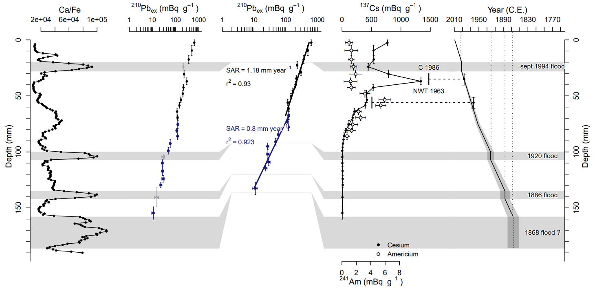

## serac <a href="https://github.com/rosalieb/serac" target="_blank"></a>

an R package for ShortlivEd RAdionuclide Chronology of recent sediment cores.

To report a problem, email me or use the Github "Issues" tool.

### Citation

Bruel, R., Sabatier, P., 2020. serac: an R package for ShortlivEd RAdionuclide chronology of recent sediment cores. <i>Journal of Environmental Radioactivity</i> <b>225</b>, 106449. https://doi.org/10.1016/j.jenvrad.2020.106449

### Download

*serac* is not available on CRAN, but can be downloaded directly from this GitHub repository:

```
install.packages("devtools")
devtools::install_github("rosalieb/serac", build_vignettes = TRUE)
library(serac)
```

### Get started

See the vignette (`vignette("serac")`) for a complete example of the functionalities of _serac_. We included in the package an example dataset for Lake Allos ([Wilhelm et al., 2012](https://www.sciencedirect.com/science/article/pii/S0033589412000294)), that allows you to reproduce the age-depth model for the core ALO09P12.

Refer to our paper ([Bruel and Sabatier, 2020](https://doi.org/10.1016/j.jenvrad.2020.106449)) for more examples.

  

**Figure 1.** Age-depth model for the core ALO09P12 as in Wilhelm et al. ([2012](https://www.sciencedirect.com/science/article/pii/S0033589412000294)), built with the package *serac*.   


### Directly skip to your first age-depth model

If you want to quickly run a first example, here is the main code allowing you to generate an age-depth model:

```
# Install and load the package and the vignette
devtools::install_github("rosalieb/serac", build_vignettes = TRUE)
library(serac)
vignette("serac")

# Create a folder for the data
dir.create(file.path(getwd(), 'Cores'), showWarnings = FALSE)
dir.create(file.path(paste0(getwd(),'/Cores'), 'serac_example_ALO09P12'), showWarnings = FALSE)

# Write in the main data
write.table(x = serac_example_ALO09P12, file = paste0(getwd(),'/Cores/serac_example_ALO09P12/serac_example_ALO09P12.txt'),col.names = T, row.names = F,sep="\t")
# Including proxy data for this core too
write.table(x = serac_example_ALO09P12_proxy, file = paste0(getwd(),'/Cores/serac_example_ALO09P12/serac_example_ALO09P12_proxy.txt'),col.names = T, row.names = F,sep="\t")

# Code for the age-depth model
model_ALO09P12 <-
  serac(name="serac_example_ALO09P12", coring_yr=2009, model=c("CFCS"),
        plotphoto=FALSE, minphoto=c(0), maxphoto=c(210),
        plot_Pb=T, plot_Am=T, plot_Cs=T, Cher=c(30,40), Hemisphere=c("NH"), NWT=c(51,61),
        sedchange=c(75.5),
        plot_Pb_inst_deposit=T, inst_deposit=c(20,28,100,107,135,142,158,186),
        suppdescriptor=TRUE, descriptor_lab=c("Ca/Fe"),
        historic_d=c(20,28,100,107,135,142,158,186),
        historic_a=c(1994,1920,1886,1868),
        historic_n=c("sept 1994 flood","1920 flood","1886 flood","1868 flood ?"), 
        min_yr=c(1750),
        dmax=c(180), 
        plotpdf=T, preview=T,
        save_code=FALSE)
```


### Version
Code versioning was not done systematically, but starting November 2024, we will specify whenever modifications are done and whether it warrants a change in the version number.  

Version | Date | Comment
:--------|:------|:--------
__V1.0.0__ | | Initial release (Bruel and Sabatier, 2020)  
__V1.1.0__ | _(2024-11-15)_ | Possibility to add hiatuses with the argument `hiatus`. See [Issue #4](https://github.com/rosalieb/serac/issues/4) for details.
