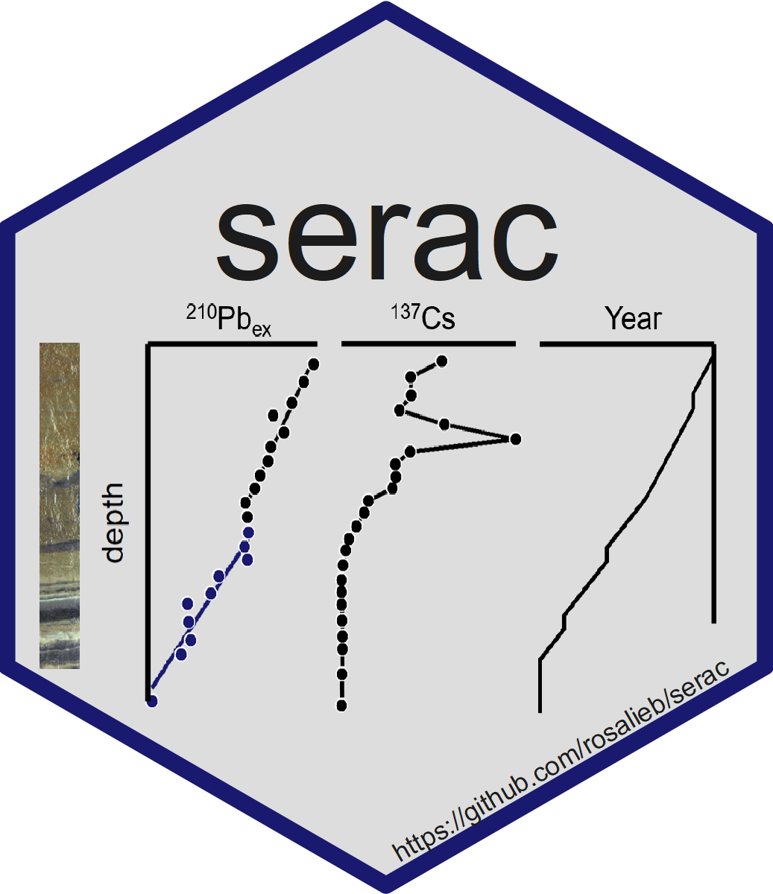

# serac 

an R package for ShortlivEd RAdionuclide Chronology of recent sediment cores.

To report a problem, email me or use the Github "Issues" tool.

To cite our method, please use:  
<b>Bruel, R., Sabatier, P., 2020.</b> serac: an R package for ShortlivEd RAdionuclide chronology of recent sediment cores. <i>Journal of Environmental Radioactivity</i> 225, 106449. https://doi.org/10.1016/j.jenvrad.2020.106449
